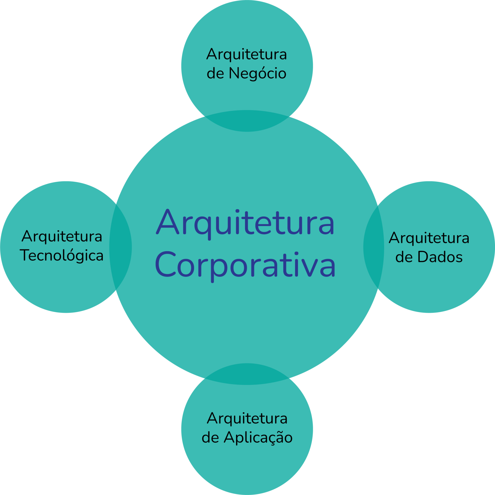

# Atividade - 24/08/2026

## Contexto

TOGAF, Desenvolvimento de Aplicações Corporativas, "Arquitetura é um negócio, não tecnologia", Atila Belloquim.

## Instruções

Faça um resumo da apresentação “Arquitetura é Negócio, não Tecnologia!“ e depois responda as seguintes perguntas:

- O que é um arquiteto?
- O que é um uma arquitetura corporativa?
- Que elementos podem estar envolvidos em uma arquitetura corporativa?
- Qual a necessidade de conhecimento de um arquiteto corporativo?
- Pesquise e avalie sobre arquitetura corporativa em Java e faça um resumo descritivo sobre quais os principais elementos desta arquitetura.

Apresentação: [Link](https://www.infoq.com/br/presentations/arquitetura-e-negocio-nao-tecnologia/)

## Resumo

O palestrante busca esclarecer que Arquitetura Corporativa não é um tema direcionado exclusivamente para o Departamento de Tecnologia. Ela é apenas um meio de **viabilização**, enquanto os **objetivos estratégicos**, a **eficiência** e o **valor gerado** para a empresa são os **objetivos finais**.

Projetar arquiteturas focando apenas em linguagens, frameworks ou infraestrutura sem compreender as necessidades do negócio resulta em desperdício financeiro e desalinhamento operacional. O profissional de arquitetura deve possuir uma visão ampla sobre toda a organização, compreendendo modelos operacionais, governança, custos, processos e capacidades corporativas (Business Capabilities).

A arquitetura atua como uma ponte que traduz a visão dos executivos (C-Level) em estruturas executáveis. A tecnologia só se justifica quando suporta o crescimento, reduz custos operacionais ou viabiliza vantagens competitivas para a empresa. A TI é apenas uma das camadas de um ecossistema maior que envolve pessoas, processos, dados e estratégias de mercado.

## Respostas

### O que é um arquiteto?

O Arquiteto Corporativo é um agente estratégico de perfil generalista responsável por desenhar, alinhar e governar a estrutura da organização. Ele atua na interseção entre os objetivos de negócio e a execução técnica, garantindo que as decisões tecnológicas suportem a estratégia da empresa de forma sustentável, escalável e economicamente viável.

### O que é um uma Arquitetura Corporativa?

É a representação conceitual e operacional da estrutura global de uma empresa. Ela define como os processos de negócio, os fluxos de informação, os sistemas de software e as infraestruturas tecnológicas se organizam e interagem entre si.

A arquitetura corporativa mapeia o estado atual da organização (**Baseline**), projeta a visão futura desejada (**Target**) e constrói o plano de migração gradual (**Roadmap**) para alcançar as metas estratégicas.

### Que elementos podem estar envolvidos em uma arquitetura corporativa?

Uma Arquitetura Corporativa engloba múltiplos elementos divididos em aspectos estruturais, artefatos de modelagem e processos de governança:

#### Domínios da Arquitetura (TOGAF):

- **Arquitetura de Negócio**: Processos, estrutura organizacional, capacidades e fluxos de valor.
- **Arquitetura de Aplicações**: Mapeamento de sistemas, interfaces e interações de software.
- **Arquitetura de Dados**: Modelos de informação, ativos de dados e governança de dados.
- **Arquitetura Tecnológica**: Infraestrutura, servidores, redes, segurança e plataformas em nuvem.

**Princípios de Arquitetura**: Diretrizes de alto nível que orientam decisões (ex.: "Dados são um ativo corporativo", "Segurança por padrão").

#### Blocos de Construção (Building Blocks):

- **ABBs (Architecture Building Blocks)**: Especificações funcionais do que a empresa precisa.
- **SBBs (Solution Building Blocks)**: Tecnologias e produtos reais que implementam as especificações.

**Artefatos de Conteúdo**: Catálogos (de aplicações, processos e atores), Matrizes (de dependências e acoplamento) e Diagramas (topologias, fluxos de integração).

**Governança e Repositório**: Processos de conformidade, comitês de arquitetura e a base centralizada de conhecimento arquitetural.

### Qual a necessidade de conhecimento de um arquiteto corporativo?

Um arquiteto corporativo precisa ter um perfil generalista e multidisciplinar, alinhando conhecimentos específicos a tecnologias específicas. É necessário que ele tenha conhecimento sobre:

1. Visão e Estratégia de Negócio
2. Frameworks, Linguagens e Governança
3. Panorama Amplo de Tecnologia (Broadness)
4. Comunicação e Liderança (Soft Skills)

### Pesquise e avalie sobre arquitetura corporativa em Java e faça um resumo descritivo sobre quais os principais elementos desta arquitetura.

A Arquitetura Corporativa em Java é uma das mais consideradas para uma estruturação de sistema de grande porte. Ela se destaca pela maturidade, segurança, alta portabilidade e suporte a transações complexas e concorrência massiva. 

Seu objetivo é garantir que a infraestrutura técnica reflita os objetivos de negócio, suportando alta concorrência, integração entre sistemas e evolução contínua.

Os principais elementos da arquitetura são:

#### Divisão em Camadas (Multi-tier Architecture)

**Apresentação (Presentation Tier)**: Ponto de entrada das requisições via interfaces web ou APIs RESTful (Spring MVC, JAX-RS, GraphQL).

**Lógica de Negócio (Business/Service Tier)**: Onde residem as regras corporativas e os fluxos de valor da organização (Spring Services, CDI/EJBs).

**Persistência de Dados (Data Access Tier)**: Mapeamento e gestão do acesso a bancos de dados relacionais e NoSQL (JPA/Hibernate, Spring Data, JDBC).

#### Frameworks e Padrões de Mercado:

**Spring Framework / Spring Boot**: Padrão de fato na indústria para criação de microserviços e sistemas corporativos modernos com injeção de dependência (IoC) e programação orientada a aspectos (AOP).

**Jakarta EE**: Conjunto de especificações abertas (JPA, JMS, JTA) mantidas pela Eclipse Foundation que padronizam o desenvolvimento Java corporativo.

#### Integração e Mensageria:

Comunicação distribuída e assíncrona entre diferentes sistemas ou microserviços através de corretores de mensagens (Apache Kafka, RabbitMQ, JMS) e serviços de integração (Apache Camel).

#### Segurança e Gestão Transacional:

**Segurança Corporativa**: Mecanismos de autenticação, autorização granular e gestão de identidade (Spring Security, OAuth2, OpenID Connect).

**Gerenciamento de Transações**: Garantia de consistência e atomicidade em operações financeiras e críticas (JTA, Spring Transaction Management).

#### Ambiente de Execução e Implantação:

Servidores de aplicação tradicionais (WildFly, Payara) ou ambientes containerizados modernos (Docker e Kubernetes) com execução via JARs autônomos.